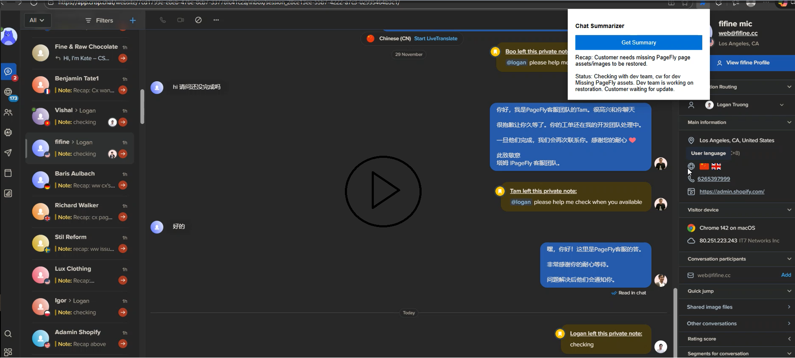

# Crisp Recap Note Tool

Crisp Recap Note là công cụ cho Fontline giúp tạo tóm tắt đoạn hội thoại. Công cụ sử dụng trực tiếp API của Gemini, có thể tóm tắt những diễn biến của cuộc hội thoại trong vòng một ca làm việc của Fontline. Công cụ này có thể được sử dụng để nắm bắt được diễn biến của ca trước đó hoặc để tạo recap note khi kết thúc ca làm.

## Video Demo

[](crispsummary.mp4)

_Nếu video không chạy, hãy bấm vào [Link dự phòng tại đây](https://github.com/ks1610/recapnote/blob/master/crispsummary.mp4)_

## Các tính năng chính

- **Tự động tóm tắt:** Quét nội dung tin nhắn trong phiên làm việc (hoặc 3 giờ 15 phút gần nhất).
- **Chỉ lấy nội dung mới** sau lần Recap cuối cùng.
- **Chuẩn hóa Status:** Tự động xác định trạng thái:
  - `fixed` — đã được khắc phục.
  - `ww for response` — đang chờ khách trả lời.
  - `cw for dev` — đã chuyển kỹ thuật/Dev kiểm tra.

---

## Hướng dẫn sử dụng tool

### Bước 0: Tải mô hình về thiết bị cá nhân

1. Ở góc phải màn hình, chọn **`<> Code`** → chọn **`Download ZIP`**.
2. Giải nén file zip.

---

### Bước 1: Lấy API Key của Gemini

Để công cụ hoạt động, bạn cần một chìa khóa (API Key) từ Google. Nó hoàn toàn **miễn phí**.

1. Truy cập: [Google AI Studio](https://aistudio.google.com/api-keys)
2. Đăng nhập bằng tài khoản Google (Gmail) của bạn.
3. Nhấn vào nút **Create API key**.
4. Chọn **Create API key in new project**.
5. Copy đoạn mã bắt đầu bằng `AIza...` lại.

---

### Bước 2: Cấu hình Extension

Tạo một file mới tên `config.js` và dán code dưới đây:

```javascript
const CONFIG = {
    GEMINI_API_KEY: "YOUR_API_KEY_HERE" // API key lấy được ở bước 1
};
```

---

### Bước 3: Cài đặt lên trình duyệt

Công cụ này chưa có trên Store, bạn cần cài đặt thủ công (Sideload) như sau:

1. Trong trình duyệt, chọn **Extensions** → **Manage Extensions**.
2. Bật công tắc **Developer mode** ở góc trên bên phải.
3. Nhấn nút **Load unpacked**.
4. Chọn thư mục chứa code.

---

### Bước 4: Sử dụng công cụ

1. Truy cập trang chat [Crisp](https://app.crisp.chat/website/).
2. Mở một cuộc hội thoại với khách hàng.
3. Nhấn vào biểu tượng **Extensions** trên thanh công cụ trình duyệt.
4. Nhấn nút **Get Summary**, đợi khoảng 2–3 giây để AI phân tích.
5. Nhấn nút **Copy Result** hiện ra bên dưới.
6. Dán (Paste) vào phần **Private Note** trên Crisp.

---

## Lưu ý quan trọng

- **Bảo mật:** Không chia sẻ file `config.js` chứa API Key của bạn cho người lạ.
- **Lỗi không chạy:** Nếu bấm nút mà không thấy gì, hãy thử F5 lại trang Crisp hoặc kiểm tra xem bạn đã dán đúng API Key chưa.
- **Hạn mức:** Với API Key miễn phí của Google, số lần request có thể bị hạn chế.
